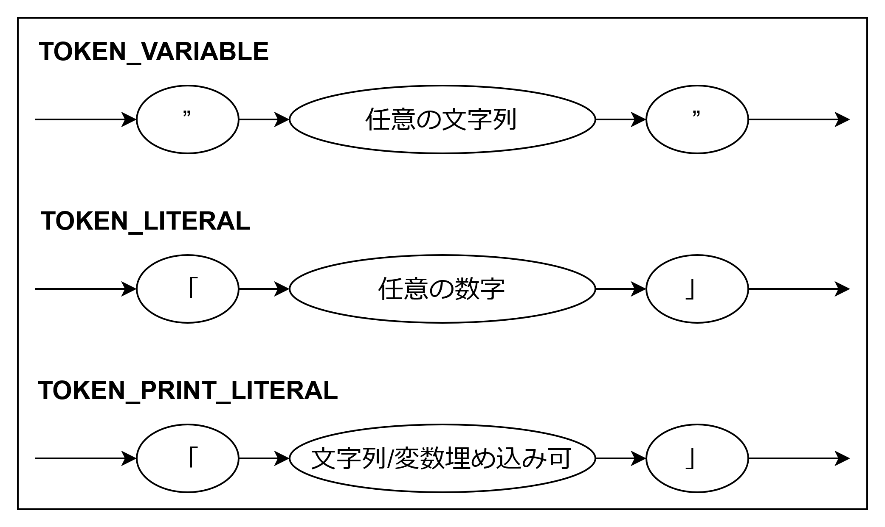
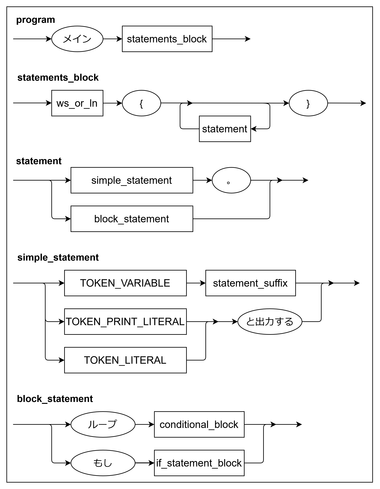
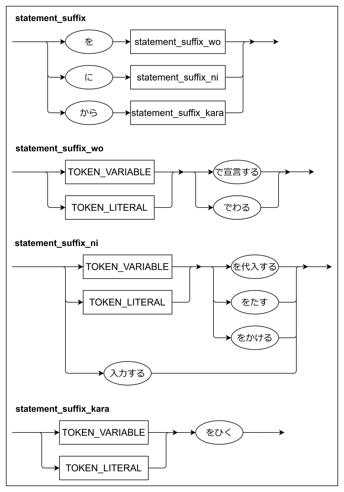
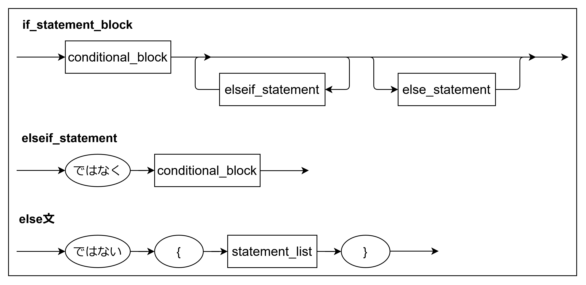
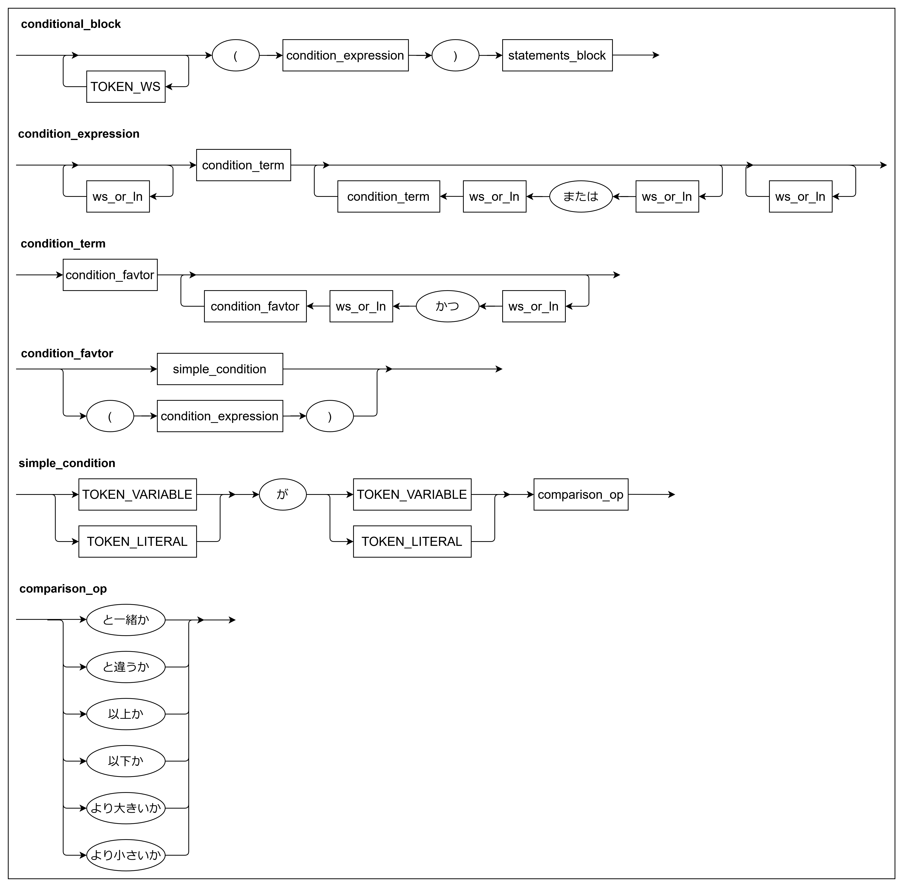

# jpc 言語 仕様書

## 1. jpc の概要

jpc（japanese c-like language）は、日本語の構文を特徴とする手続き型言語です。jpc コンパイラ（jpc コマンド）は、.jpc ソースファイルを C 言語のソースファイル（.c）にトランスパイル（翻訳）し、gcc コンパイラを呼び出してネイティブの実行ファイルを生成します。

## 2. 使用方法（コンパイラオプション）
```
./jpc [オプション] <入力ファイル.jpc>
```
```jpc```コマンドは、入力された```.jpc```ファイルを C 言語のソースコードにトランスパイルします。 オプションが指定されない場合、トランスパイルされた C コードは標準出力に出力されます。

### オプション

- `-o <ファイル名>`<br>
  トランスパイル後に gcc を呼び出し、実行ファイル <ファイル名> を生成します。 このオプションを指定すると、C コードは標準出力に表示されなくなります。
- `-k <ファイル名>`<br>
  コンパイルの過程で生成される一時的なC言語のソースファイルを削除せずせず、<ファイル名> で保存します。

### 実行例
1. Cコードをターミナルで確認する（jpc→C）
    ```
    ./jpc tests/test.jpc
    ```

2. Cコードを```test.c```に保存する（jpc→C）
    ```
    ./jpc tests/test.jpc -k test.c
    ```

3. 実行ファイル```test```を生成する（jpc→C→実行ファイル）
    ```
    ./jpc tests/test.jpc -o test
    ```

4. 実行ファイル```test```を生成し、Cコードも```test.c```として残す（jpc→C→実行ファイル）
    ```
    ./jpc tests/test.jpc -o test -k test.c
    ```

## 3. 字句・トークンの定義

jpc コンパイラは、以下のルールに従ってソースコードをトークンへ分割します。空白（スペース、タブ、改行）はトークンの区切りとして扱われ、無視されます。

### 3.1. コメント

以下の形式はコメントとして扱われ、コンパイラによって無視されます（C ソースコードには出力されません）。

- **行コメント**: `＃` (全角シャープ)
  - `＃` からその行の行末（改行）までをコメントとして扱います。<br>
- **ブロックコメント**: `＄` (全角ドル)
  - `＄` から、次に `＄` が現れるまでの区間をコメントとして扱います。
  - 複数行にまたがって記述することができます。

### 3.2. リテラル (2 種類)

jpc のリテラルは `「` と`」` で囲みますが、文脈によって 2 種類の異なるトークンとして扱われます。

1. 数値リテラル (`TOKEN_LITERAL`)

   - 用途: 計算、代入、条件式など。
   - 内容: 数字のみ。全角数字（例: １２３）は半角（123）に自動変換されます。
   - 型: 内部的にはすべて double 型として扱われます。

2. 出力リテラル (`TOKEN_PRINT_LITERAL`)
   - 用途: ...と出力する 文のみ。
   - 内容: 任意の文字列。
   - 機能:
     - 変数埋め込み: 文字列中に`”変数名”`を記述すると、その変数の値に置換されて出力されます。
     - 改行制御: 文字列の末尾が`：`（全角コロン）の場合、改行なしで出力します。それ以外は末尾に改行を付加します。

### 3.3. 変数名 (`TOKEN_VARIABLE`)

定義: `”`（ダブルクォーテーション）で囲まれた、`”` を含まない任意の文字列。
内容: 数字始まりや空白を含んでも問題ありません（C 言語変換時に jpc_var_1, jpc_var_2... と一意な ID に置換されるため）。
例: `”入力値”`, `”1番目のデータ”`

## 4. 型システムと変数のスコープ

### 4.1. 型

すべての変数は、内部的に double 型（倍精度浮動小数点数） として扱われます。

### 4.2. 変数のスコープ

変数のスコープ（有効範囲）は`｛ ... ｝`ブロックによって定義されます。これは C 言語のレキシカルスコープと同様です。

- 上位ブロック（親スコープ）で宣言された変数は、下位ブロック（子スコープ）で使用できます。
- 下位ブロックで宣言された変数を、そのブロックの外（上位スコープ）から参照することはできません（コンパイルエラー）。

## 5. 構文・命令リファレンス

プログラム全体は メイン ｛ ... ｝ ブロックで構成されます。
jpc 言語では、C 言語のセミコロン（;）に相当する区切り文字として、 **句点** `。`を使用します。

- 単文（宣言、代入、演算、入出力）: 末尾に必ず「。」を付けます。
- ブロック文（ループ、もし）: 末尾に「。」は不要です。

### 5.1. 宣言・代入

- 宣言: `”A” を「10」で宣言する。`<br>
  現在のブロックに変数を登録します。同名の変数が同ブロックに存在する場合はエラーとします。

- 代入: `”A” に「20」を代入する。`<br>
  既存の変数の値を上書きします。

### 5.2. 入出力

- 入力: `”A”に入力する。`<br>
  標準入力から数値を読み取り、変数`A`に代入します。
- 出力: `「...」と出力する。`<br>
  前述の「出力リテラル」に従って標準出力に表示します。

### 5.3. 四則演算

結果は左側の変数に上書きされます（自己代入）。右側の値にはリテラルまたは他の変数を指定できます。

- `”A”に「5」をたす。`　　(A += 5)
- `”A”から”B”をひく。`　　(A -= B)
- `”A”に「2」をかける。`　(A \*= 2)
- `”A”を”C”でわる。`　　　(A /= C)

### 5.4. 制御構造

- ループ: `ループ（ 条件式 ）｛ ... ｝`<br>
  条件式が真である間、ブロックを繰り返します（前判定ループ）。

- 条件分岐:<br>
  ```
  もし （ 条件式 ） ｛ ... ｝
  ではなく （ 条件式 ） ｛ ... ｝
  ではない ｛ ... ｝
  ```
  `ではなく`は 0 回以上、`ではない`は 0 回または 1 回記述可能です。

## 6. 条件式

条件式は「真」か「偽」を評価します。

- 論理演算子:

  - `かつ` (AND): 優先順位 高
  - `または` (OR): 優先順位 低
  - 例: `A　または　B　かつ　C` は `A　または　(B　かつ　C)`と解釈されます。

- 比較演算:
  - `”A”が”B”以上か`
  - `”A”が”B”以下か`
  - `”A”が”B”より大きいか`
  - `”A”が”B”より小さいか`
  - `”A”が”B”と一緒か`（数値としての等価比較）
  - `”A”が”B”と違うか`（数値としての不等価比較）

## 7. jpc コードの実装例

- `sample.jpc`

  ```
  メイン｛
      ”カウントダウン”を「３」で宣言する。
      ”合計値”を「０」で宣言する。
      ”入力値”を「０」で宣言する。
      ＃　この行はコメントです。
      ＄
          このブロック内はすべてコメントです。
          なので何を記述しても問題ないです。
      ＄
      ループ（”合計値”が「１００」以下か　かつ　”カウントダウン”が「０」より大きいか）｛
          「整数を入力してください：」と出力する。
          ”入力値”に入力する。
          ”合計値”に”入力値”をたす。
          ”カウントダウン”から「１」をひく。
      ｝
      もし（”合計値”が「１００」以上か）｛
          「合計値は”合計値”です」と出力する。
      ｝
      ではなく（”合計値”が「５０」以上か）｛
          「合計値は５０以上１００未満です」と出力する。
      ｝
      ではない｛
          「合計値は５０未満です」と出力する。
      ｝
      「小数にも対応しています」と出力する。
      「１０と掛けたい少数を入力してください：」と出力する。
      ”入力値”に入力する。
      ”計算結果”を”入力値”で宣言する。
      ”計算結果”に「１０」をかける。
      「１０✕”入力値”＝”計算結果”」と出力する。
      「１０で割りたい少数を入力してください：」と出力する。
      ”入力値”に入力する。
      ”計算結果”に”入力値”を代入する。
      ”計算結果”を「１０」でわる。
      「”入力値”÷１０＝”計算結果”」と出力する。

      「１００と入力してください：」と出力する。
      ”入力値”に入力する。
      ループ（”入力値”が「１００」と違うか）｛
          「”入力値”は１００ではないです」と出力する。
          「１００と入力してください：」と出力する。
          ”入力値”に入力する。
      ｝
      もし（”入力値”が「１００」と一緒か）｛
          「”入力値”が＜１００＞になりました」と出力する。
      ｝
  ｝
  ```

- `sample.c`

  ```c
  #include<stdio.h>   // jpcには記述しないが標準で宣言する
  
  int main() {
  	double jpc_var_1 = 3.000000;
  	double jpc_var_2 = 0.000000;
  	double jpc_var_3 = 0.000000;
  	while (((jpc_var_2 <= 100.000000) && (jpc_var_1 > 0.000000))) {
  		printf("整数を入力してください：");
  		scanf("%lf", &jpc_var_3);
  		jpc_var_2 += jpc_var_3;
  		jpc_var_1 -= 1.000000;
  	}
  	if ((jpc_var_2 >= 100.000000)) {
  		printf("合計値は%fです\n", jpc_var_2);
  	} else if ((jpc_var_2 >= 50.000000)) {
  		printf("合計値は５０以上１００未満です\n");
  	} else {
  		printf("合計値は５０未満です\n");
  	}
  	printf("小数にも対応しています\n");
  	printf("１０と掛けたい少数を入力してください：");
  	scanf("%lf", &jpc_var_3);
  	double jpc_var_4 = jpc_var_3;
  	jpc_var_4 *= 10.000000;
  	printf("１０✕%f＝%f\n", jpc_var_3, jpc_var_4);
  	printf("１０で割りたい少数を入力してください：");
  	scanf("%lf", &jpc_var_3);
  	jpc_var_4 = jpc_var_3;
  	jpc_var_4 /= 10.000000;
  	printf("%f÷１０＝%f\n", jpc_var_3, jpc_var_4);
  	printf("１００と入力してください：");
  	scanf("%lf", &jpc_var_3);
  	while ((jpc_var_3 != 100.000000)) {
  		printf("%fは１００ではないです\n", jpc_var_3);
  		printf("１００と入力してください：");
  		scanf("%lf", &jpc_var_3);
  	}
  	if ((jpc_var_3 == 100.000000)) {
  		printf("%fが＜１００＞になりました\n", jpc_var_3);
  	}
  	return 0;
  }
  ```

## 8. jpc 言語 拡張 BNF

コンパイラが内部的に参照する、1 トークン先読み（LL(1)）のために最適化された BNF です。

### 8.1. 字句(トークン)の定義

```
TOKEN_VARIABLE      ::= """ (任意の文字列) """
TOKEN_LITERAL       ::= "「" (任意の数字) "」"
TOKEN_PRINT_LITERAL ::= "「" (文字列/変数埋め込み可) "」"
```



### 8.2. プログラム全体

```
program               ::= "メイン" statements_block

statements_block      ::= "｛" { statement } "｝"

statement             ::= simple_statement "。"
                        | loop_or_if_statement

simple_statement      ::= TOKEN_VARIABLE statement_suffix
                        | (TOKEN_PRINT_LITERAL | TOKEN_LITERAL) "と出力する"

loop_or_if_statement  ::= "ループ" conditional_block
                        | "もし" if_statement_block
```



### 8.3. 「変数」で始まる文

```
statement_suffix      ::= "を" statement_suffix_wo
                        | "に" statement_suffix_ni
                        | "から" statement_suffix_kara

statement_suffix_wo   ::= (TOKEN_LITERAL | TOKEN_VARIABLE) ("で宣言する" | "でわる")

statement_suffix_ni   ::= "入力する"
                        | (TOKEN_LITERAL | TOKEN_VARIABLE) ("を代入する" | "をたす" | "をかける")

statement_suffix_kara ::= (TOKEN_LITERAL | TOKEN_VARIABLE) "をひく"
```



### 8.4. IF - ELSE IF - ELSE 制御構造

```
if_statement_block    ::= conditional_block
                          { "ではなく" conditional_block }
                          [ "ではない" statements_block ]
```



### 8.5. 条件式（階層構造）

```
conditional_block     ::= "（" condition_expression "）" statements_block

condition_expression  ::= condition_term { "または" condition_term }

condition_term        ::= condition_factor { "かつ" condition_factor }

condition_factor      ::= simple_condition
                        | "（" condition_expression "）"

simple_condition      ::= (TOKEN_LITERAL | TOKEN_VARIABLE) "が" (TOKEN_LITERAL | TOKEN_VARIABLE) comparison_op

comparison_op         ::= "以上か" | "以下か" | "より大きいか" | "より小さいか" | "と一緒か" | "と違うか"
```


